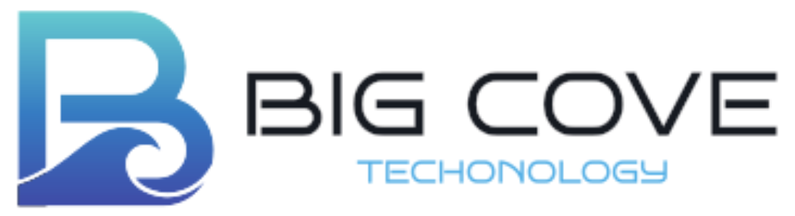
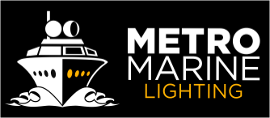

  
  

# Big Cove Technology & Metro Marine Lighting

Welcome to the official collaboration organization for Big Cove Technology and Metro Marine Lighting.

## About

- **Big Cove Technology** ([bigcove.io](https://bigcove.io)) specializes in product design, embedded systems, IoT solutions, and cloud applications. 
- **Metro Marine Lighting** ([metromarinelighting.com](https://metromarinelighting.com)) delivers cutting-edge underwater lighting with patented UVC technology to prevent biofouling and condensation. 
<!--
## Repositories

| Repository                      | Description                                              |
|---------------------------------|----------------------------------------------------------|
| [Controller UI](https://github.com/big-cove-mm/light_controller_ui)             | Web dashboard for real-time monitoring and configuration. |
| [Controller Firmware](https://github.com/big-cove-mm/light_controller_firmware) | Embedded firmware for full-spectrum RGBW control.        |
| [Controller Operating System](https://github.com/big-cove-mm/light_controller_os) | Custom Linux Kernel for the lighting controller.        |
| [iOS Discovery Tool](https://github.com/big-cove-mm/discovery) | iOS Discovery Tool for end users to discovery Controllers on a LAN.        |
-->

## Getting In Touch

For inquiries or support:  
📧 info@bigcove.io  
🌐 [bigcove.io](https://bigcove.io)
